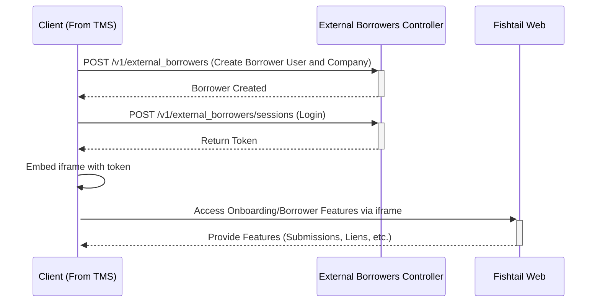

# ft-external-onboarding
An example of how to integrate Fishtail's onboarding features

For more detailed information on API endpoints and requests, refer to the Postman collection.

Remember that using the provided endpoints requires an API key as Authorization bearer. Reach out to the Fishtail team if you need one.

## Walkthrough

This example demonstrates how to create a borrower user and company, log in to get an access token, and use that token to embed onboarding/borrower features into an external application using an iframe.

### Workflow Overview

### Example Page

Watch this example page walkthrough to understand the integration process:

https://www.loom.com/share/4f12f8548fdb463ca46dabbecc435fe7

### Postman Collection

https://www.loom.com/share/aed3339babb749059de8fd536e8d5f4a
